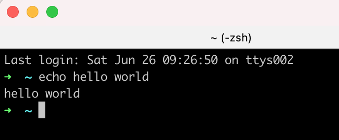

# Build you own shell

> What I cannot create, I do not understand. - Richard Feynman

Reinventing wheels is waste of time, if you still want to do that, keep reading this.

## What is Shell

Shell is a software that most programmer will use to interact with computer system by keyboard, instead of Graphical User Interface. You may familiar with some shell like: [bash](https://en.wikipedia.org/wiki/Bash_(Unix_shell)),[zsh](https://en.wikipedia.org/wiki/Z_shell)。



## Tech Stack

Language & Standard：C++17

Build Tool：CMake

Test：Google Test

Code Style：Google C++

Dependency Management：Conan

Continues Integration：Github Action

## Resources

Code：[superxcgm/xcShell](https://github.com/superxcgm/xcShell)

KANBAN：[xcShell](https://github.com/users/superxcgm/projects/4)

You may need to read README in this repo and know how to build and run.

## Structual

Shell have 3 major parts：

1. Init：Load configuration file (For example: zsh will load `.zshrc`)
2. REPL：Read user input, execute, read user input, execute, loop.
3. exit：Release resources and recover terminal configuration.

```c++
class XcShell {
 public:
  void init();
  void process();
  int exit();
};
```

We add a `XcShell` class, contains three methods,  each one related to one pard we mentioned before. It's a initial siganature, we will update it later according our requirement. We will focus on `process` at first, and other two parts will discuss later.

[Related Pull Request](https://github.com/superxcgm/xcShell/pull/7)

## Process

### Read User Input

We will print `>` to hint user to input something, and use `getline` to get what user input. We will print user input to console after we read it, and hint user again, print again, until user input end(EOF). (You can use `Ctrl +D` to send EOF to program)

```c++
void XcShell::process(std::istream &is, std::ostream &os) {
  while (!is.eof()) {
    os << "> ";
    std::string line;
    getline(is, line);
    os << line << std::endl;
  }
}
```

We update parameter of `process`, inject input/output rather than dependent on `stdin`, `stdout` directly, in order to make our code testable.

Known issue: `line` here can be huge line if you have enough RAM, but I found it can only input 1024 characters on iTerm2 when I'm test. But it works fine if I use input redirection. So it might not related to `string` and `getline`.[issue/14](https://github.com/superxcgm/xcShell/issues/14)

[Related Pull Request](https://github.com/superxcgm/xcShell/pull/13)

### Parse User Input

After reading user input, we need to split it into two pards: (Forget input/output redirection, pipe and etc.)

1. Command
2. Argument list

For `echo hello world`

We need to split it into command `echo` and argument list `['hello', 'world']`

```c++
std::tuple<std::string , std::vector<std::string>>
XcShell::parseUserInput(const std::string &str) {
  auto parts = xc_utils::split(str);
  std::string command = parts[0];
  parts.erase(parts.begin());
  return {command, parts};
}
```


```c++
std::vector<std::string> xc_utils::split(const std::string& str) {
  std::stringstream ss(str);
  std::vector<std::string> parts;

  while (ss) {
    std::string part;
    ss >> part;
    parts.push_back(part);
  }

  if (parts[parts.size() - 1] == "") {
    parts.pop_back();
  }

  return parts;
}
```

We use `stringstream` to split input and use space as delimeter. (We don't handle quotation marks here, `"hello world"` will simple split to `"hello` and `world"`, we will add this feature later)

[Related Pull Request](https://github.com/superxcgm/xcShell/pull/15)

### Execution

Shell will find program in PATH environment variable and create a new process to run our program, after we input command in shell and press `Enter`. Shell will block when our program running, till it quit. For example: we input `ls -l` and press `Enter`, shell will find `/bin/ls` in PATH env and run it with args `-l` and wait it to exit.

Timeline looks like this：

```
ls        ----
shell ----    ----
```

Shell will blocked when `ls` start to run, and continue when `ls` quit.

```c++
pid_t pid = fork();
if (pid == 0) {
  return ProcessChild(command, args, err_os);
} else {
  WaitChildExit(pid);
}
```

We use Linux system call `fork` to create new process. New process will become child of current process and copy all resources, including code.

`fork` will return twice when call only once. It will return 0 as `pid` for child process, we call `ProcessChild` to run user command. And return positive `pid` for parent process, the `pid` is child process identity. We call `WaitChildExit` to block shell and wait user command to quit. (You can use `man fork` to get more information about  system call `fork`)

Let's have a look in details of `ProcessChild`：

```c++
int CommandExecutor::ProcessChild(const std::string &command,
                                   const std::vector<std::string> &args,
                                   std::ostream &err_os) {
   // child
   auto argv = BuildArgv(command, args);

   auto ret = execvp(command.c_str(), &argv[0]);
   // should not execute to here if success
   if (ret == ERROR_CODE_SYSTEM) {
     PrintSystemError(err_os);
   }
   return ERROR_CODE_DEFAULT;
 }
```

We use `BuildArgv` to build arguments, and for `ls -l`, we will get `['ls', '-l', '\0']`. First argument same as command and last argument is `\0` which indicate end of array, cause it will lost length info when passing C native array.

We use `execvp` to execute `ls -l`, `execvp` will automatically find `ls` in PATH env and execute, it will replace all code of current process, ie. use `ls` code to replace our shell code. And will not return it execute sucessful.(You can use `man execvp` to get more information about  system call `execvp`)

Let's have a look what parent process do：

```c++
void CommandExecutor::WaitChildExit(pid_t pid) {
   int status;
   do {
     waitpid(pid, &status, WUNTRACED);
   } while (!WIFEXITED(status) && !WIFSIGNALED(status));
 }
```

Parent use `waitpid` system call to get  status change of child process, and keep monitor if child process do not quit, till child process quit.(You can use `man waitpid` to get more information about  system call `waitpid`)

[Related Pull Request](https://github.com/superxcgm/xcShell/pull/16) （Ignore pipe related code）

### Build-in Commands：`cd`

We can know that `cd` is a build-in command for shell if you use `which cd` in `bash` or `zsh`. It's use to change shell working direction and not a program.

```c++
std::string GetHome() {
   auto pw = getpwuid(getuid());
   return pw->pw_dir;
}

int XcShellCd(std::vector<std::string> args, std::ostream &err_os) {
   static std::string pre;
   if (args.size() > 1) {
     err_os << "invalid args" << std::endl;
     return ERROR_CODE_DEFAULT;
   }

   std::string path = args.empty() ? "~" : args[0];
   if (path == "~") {
     path = GetHome();
   } else if (path == "-") {
     path = pre;
     // cover when pre is empty
     if (path.empty()) {
       path = ".";
     }
   }
   char buf[BUFSIZ];
   if (getcwd(buf, BUFSIZ) == nullptr) {
     PrintSystemError(err_os);
     return ERROR_CODE_DEFAULT;
   }
   pre = buf;

   int ret = chdir(path.c_str());
   if (ret == ERROR_CODE_SYSTEM) {
     PrintSystemError(err_os);
     return ERROR_CODE_DEFAULT;
   }
   return 0;
 }
```

We use system call `chdir` here to change workding direction of current process. We use `getpwuid` to get user home direction in order to support `cd ~`. And use `static` to remember previous working direction to support `cd -`.

We use a map to save build-in name and handler:

```c++
std::map<std::string, int (*)(std::vector<std::string>, std::ostream &)> mp = {
     {"cd", XcShellCd}};
```

handler is a funtion pointer, point to funtion which return int and arguments are `args` and `ostream`

[Related Pull Request](https://github.com/superxcgm/xcShell/pull/19) （Ignore pipe related code）

### Display Current Working Directory

For most shell, it will display current working directory, we also need this. We only diplay last directory path instead of whole path. For `/home/superxcgm/Download`, we simply display`Download`.

We use library funtion `getcwd` to get current working directory (full path).

```c++
std::string xc_utils::GetCurrentWorkingDirectory(std::ostream& err_os) {
   char buf[BUFSIZ];
   if (getcwd(buf, BUFSIZ) == nullptr) {
     PrintSystemError(err_os);
     return "";
   }
   return buf;
 }
```

And extract last directory, for root directory `/`, it is also `/`.

```c++
std::string xc_utils::GetLastDir(const std::string& path) {
   if (path == "/") {
     return "/";
   }
   std::string path_std =
       path[path.size() - 1] == '/' ? path.substr(0, path.size() - 1) : path;
   auto idx = path_std.rfind('/');
   return path_std.substr(idx + 1);
 }
```

And generate hint, and display `~` for user home directory.

```c++
std::string XcShell::generatePrompt(std::ostream &err_os) {
   auto pwd = xc_utils::GetCurrentWorkingDirectory(err_os);
   auto home = xc_utils::GetHomeDir();
   std::string dir;
   if (home == pwd) {
     dir = "~";
   } else {
     dir = xc_utils::GetLastDir(pwd);
   }
   return dir + " > ";
 }
```

[Related Pull Request](https://github.com/superxcgm/xcShell/pull/20) 

