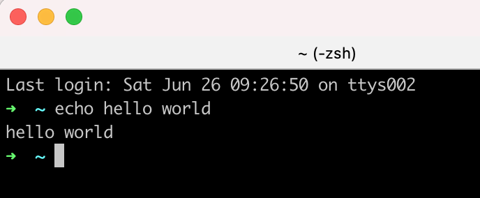

# 构建你自己的shell

> What I cannot create, I do not understand. - Richard Feynman

重复发明轮子是程序员的传统美德，如果你也想浪费时间，那就看下去吧。

## 什么是Shell

Shell是大多程序员都会用到的一种软件，通过使用键盘敲入指令和系统交互，而不是通过可见即所得（What you see is what you get）的图形化窗口（GUI）。常见的shell一般有[bash](https://zh.wikipedia.org/wiki/Bash), [zsh](https://zh.wikipedia.org/wiki/Z_shell)等。



## 技术栈

语言&标准：C++17

构建工具：CMake

测试：Google Test

代码风格：Google C++

依赖管理：Conan

持续集成：Github Action

## 相关资源

代码：[superxcgm/xcShell](https://github.com/superxcgm/xcShell)

看板：[xcShell](https://github.com/users/superxcgm/projects/4)

在使用代码之前，你可能需要先阅读代码仓库里的README，了解如何构建和运行。

## 结构

Shell大体可以分为以下三个部分：

1. 启动：加载配置文件（如：zsh会在启动时加载`.zshrc`）。
2. REPL：读取用户输入的指令，执行，读取用户输入的指令，执行不断循环。
3. 退出：清理所用到资源，恢复终端设置。

```c++
class XcShell {
 public:
  void init();
  void process();
  int exit();
};
```

我们创建了一个XcShell的类，包含了三个方法，每个方法对应上面提到的一个部分。参数和返回值的部分先简单写了一下，后面还会再改。我们会先关注中间的process部分，其他两部分在后面再考虑。

[相关代码提交](https://github.com/superxcgm/xcShell/pull/7)

## Process

### 读取用户输入

这里我们首先输出`> `提示用户输入，使用`getline`来获取用户输入的行，然后打印用户的输入，再提示用户输入，读用户输入，打印，直到用户输入结束（EOF）。（你可以通过按`Ctrl + D`向程序发送EOF）

```c++
void XcShell::process(std::istream &is, std::ostream &os) {
  while (!is.eof()) {
    os << "> ";
    std::string line;
    getline(is, line);
    os << line << std::endl;
  }
}
```

这里修改了`process`方法的入参，注入了输入/输出，而不是直接依赖`stdin`、 `stdout`，提升可测试性。

Known issue: 这里的line理论上可以支持很大的行，只要你内存管够，但我实际在测试的时候，发现在iTerm2里只能输入1024个字符，但是使用输入重定向到文件的话，就没有这个限制，所以应该不是`string`和`getline`的锅。[issue/14](https://github.com/superxcgm/xcShell/issues/14)

[相关代码提交](https://github.com/superxcgm/xcShell/pull/13)

### 解析用户输入

上一步我们读到的是一整个字符串，所以我们需要将它拆分成两个部分（先不考虑其他功能，如输入输出重定向、管道等）：

1. 命令
2. 参数列表

如`echo hello world`

需要拆分成命令`echo`和参数列表`['hello', 'world']`。

```c++
std::tuple<std::string , std::vector<std::string>>
XcShell::parseUserInput(const std::string &str) {
  auto parts = xc_utils::split(str);
  std::string command = parts[0];
  parts.erase(parts.begin());
  return {command, parts};
}
```


```c++
std::vector<std::string> xc_utils::split(const std::string& str) {
  std::stringstream ss(str);
  std::vector<std::string> parts;

  while (ss) {
    std::string part;
    ss >> part;
    parts.push_back(part);
  }

  if (parts[parts.size() - 1] == "") {
    parts.pop_back();
  }

  return parts;
}
```

这里简单地使用了`stringstream`去拆分输入，使用空格作为分割符（这里没有处理引号，`"hello world"`会被拆分成`"hello`和`world"`，会在后面去支持）。

[相关代码提交](https://github.com/superxcgm/xcShell/pull/15)

### 执行

当我们在shell中输入指令，并按下回车时，shell会启动一个新的进程来运行我们的程序，程序会在PATH环境变量中查找，程序运行时，shell会阻塞住，直到程序退出。比如我们输入`ls -l`，并回车时，shell在PATH环境中找到`/bin/ls`然后运行，并将参数`-l`传递给它，接着等待ls退出。时序图大概是这样的：

```
ls        ----
shell ----    ----
```

`ls`开始运行时，shell就阻塞，直到`ls`退出。

```c++
pid_t pid = fork();
if (pid == 0) {
  return ProcessChild(command, args, err_os);
} else {
  WaitChildExit(pid);
}
```

这里我们使用Linux系统调用`fork`来产生新的进程，新的进程会变成当前进程的子进程，并且会复制父进程的资源，包括代码。`fork`调用一次，会返回两次。`pid`为0时，代表当前是子进程，我们这里调用了`ProcessChild`来运行用户输入的指令。如果`pid`大于0，代表当前是父进程，`pid`的值为子进程的进程号。我们这里调用了`WaitChildExit`阻塞父进程，等待子进程退出。（可以使用`man fork`来查看`fork`系统调用的更多信息）

再来看一下`ProcessChild`的内部细节：

```c++
int CommandExecutor::ProcessChild(const std::string &command,
                                   const std::vector<std::string> &args,
                                   std::ostream &err_os) {
   // child
   auto argv = BuildArgv(command, args);

   auto ret = execvp(command.c_str(), &argv[0]);
   // should not execute to here if success
   if (ret == ERROR_CODE_SYSTEM) {
     PrintSystemError(err_os);
   }
   return ERROR_CODE_DEFAULT;
 }
```

我们首先调用`BuildArgv`构造了参数，对于上面提到的`ls -l`的例子，我们会构建出`['ls', '-l', '\0']`，第0个参数和命令名一致，最后一个参数为`\0`，因为C语言数组在传参的时候，会丢失长度信息，所以这里用`\0`来指示数组末尾。

构造好参数列表之后，我们使用`execvp`来执行`ls -l`，`execvp`会在PATH环境变量指示的目录中查找`ls`，然后执行，执行的时候，会替换掉当前进程的所有代码，即用`ls`的代码替换当前的代码，如果执行成功的话，不会返回。（可以使用`man execvp`来查看`execvp`系统调用的更多信息）

再回头看看父进程干啥去了：

```c++
void CommandExecutor::WaitChildExit(pid_t pid) {
   int status;
   do {
     waitpid(pid, &status, WUNTRACED);
   } while (!WIFEXITED(status) && !WIFSIGNALED(status));
 }
```

父进程通过`waitpid`系统调用来获取子进程状态的变化信息，如果子进程没有退出，就继续观察，直到子进程退出。（可以使用`man waitpid`来查看`waitpid`系统调用的更多信息）

[相关代码提交](https://github.com/superxcgm/xcShell/pull/16) （可以先忽略代码中和管道`pipe`相关的代码）

### 内建命令支持：`cd`

通过`which cd`命令，我们可以发现，cd其实是一个内建命令（build-in），不是一个程序，主要用于修改shell的工作目录。

```c++
std::string GetHome() {
   auto pw = getpwuid(getuid());
   return pw->pw_dir;
}

int XcShellCd(std::vector<std::string> args, std::ostream &err_os) {
   static std::string pre;
   if (args.size() > 1) {
     err_os << "invalid args" << std::endl;
     return ERROR_CODE_DEFAULT;
   }

   std::string path = args.empty() ? "~" : args[0];
   if (path == "~") {
     path = GetHome();
   } else if (path == "-") {
     path = pre;
     // cover when pre is empty
     if (path.empty()) {
       path = ".";
     }
   }
   char buf[BUFSIZ];
   if (getcwd(buf, BUFSIZ) == nullptr) {
     PrintSystemError(err_os);
     return ERROR_CODE_DEFAULT;
   }
   pre = buf;

   int ret = chdir(path.c_str());
   if (ret == ERROR_CODE_SYSTEM) {
     PrintSystemError(err_os);
     return ERROR_CODE_DEFAULT;
   }
   return 0;
 }
```

这里我们用`chdir`系统调用修改当前进程的工作目录，为了支持`cd ~`切到用户HOME目录，我们使用了`getuid`系统调用获取用户的id，通过`getpwuid`获取用户的HOME目录。为了支持`cd -`切到之前的目录，我们使用了`static`变量来保存用户之前的目录。

为了支持以后更多的内建命令，我们这里使用了一个map来保存内建指令的名字和对应的handler。

```c++
std::map<std::string, int (*)(std::vector<std::string>, std::ostream &)> mp = {
     {"cd", XcShellCd}};
```

handler为一个函数指针，指向了返回值为int，参数为args和ostream的函数。

[相关代码提交](https://github.com/superxcgm/xcShell/pull/19) （可以先忽略代码中和管道`pipe`相关的代码）

### 显示当前所在目录

一般来说，shell都会提示我们当前在哪个目录，所以我们也需要实现这个功能。我们这里不会显示完整的绝对路径，只会显示最后一级目录，比如`/home/superxcgm/Download`，我们只会显示`Download`。

我们通过`getcwd`库函数获取当前的工作目录（绝对路径）。

```c++
std::string xc_utils::GetCurrentWorkingDirectory(std::ostream& err_os) {
   char buf[BUFSIZ];
   if (getcwd(buf, BUFSIZ) == nullptr) {
     PrintSystemError(err_os);
     return "";
   }
   return buf;
 }
```

然后截取最后一个目录，但是对于根目录`/`，最后一个目录就是`/`。

```c++
std::string xc_utils::GetLastDir(const std::string& path) {
   if (path == "/") {
     return "/";
   }
   std::string path_std =
       path[path.size() - 1] == '/' ? path.substr(0, path.size() - 1) : path;
   auto idx = path_std.rfind('/');
   return path_std.substr(idx + 1);
 }
```

然后生成提示字符串，如果是用户HOME目录，我们直接显示`~`。

```c++
std::string XcShell::generatePrompt(std::ostream &err_os) {
   auto pwd = xc_utils::GetCurrentWorkingDirectory(err_os);
   auto home = xc_utils::GetHomeDir();
   std::string dir;
   if (home == pwd) {
     dir = "~";
   } else {
     dir = xc_utils::GetLastDir(pwd);
   }
   return dir + " > ";
 }
```

[相关代码提交](https://github.com/superxcgm/xcShell/pull/20) 
